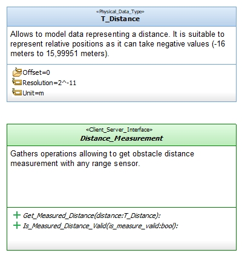

# Geometrics_Interfaces

This package gathers interfaces and types allowing to manage geometric data.

Modeled using the [Software_Model_Toolset](https://github.com/HomeMadeRobots/Software_Model_Toolset).

Implemented using the [Embedded_C_Framework](https://github.com/HomeMadeRobots/Embedded_C_Framework).

## Distance_Measurement

